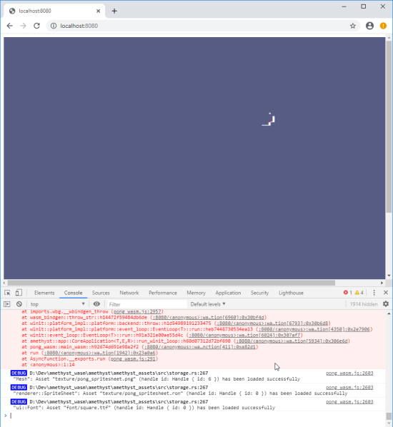

# Week 2: End-to-End Discovery

## Summary

**Date:** 2020-03-22 to 2020-03-28

* Limitations discovered around:

    - `winit` event loop and WASM event loop requirements.
    - Web worker threading requirements.
    - Audio loading requirements.
    - Texture loading requirements.

* Assets load from HTTP source using XHRs.

| Repository          | Commit Range          |
| ------------------- | --------------------- |
| [`pong_wasm`]       | `3bcf94de^..de355df6` |
| [`amethyst`]        | `65a1e27a^..1d491d18` |
| [`rendy`]           | `e1e03fee^..4de9ca2a` |
| [`winit`] \(fork\)  | `8595aec7^..9827b34a` |
| [`gfx-rs`] \(fork\) | `a9a4419d^..672f551a` |
| [`web_worker`]      | `892abf29^..2b78b6ca` |

### End Result

## Implementation

1. Clean up [`web_worker`] repository.

    - Move `jojolepro/web_worker` to `amethyst/web_worker`
    - Allow constructing thread pool without JavaScript (workers still need `worker.js` to run).

2. Get dispatcher to execute serially &ndash; `"no-parallel"`. ([amethyst#2177], [amethyst#2189], [amethyst#2191])
3. Assets load from server via `XmlHttpRequest`s. ([amethyst#2180])

    - Loading texture assets into GL backend. ([amethyst#2174])

4. Get GL to render correctly. ([amethyst#2198])
5. Update `pong_wasm` to run. ([pong_wasm#3bcf94d])

[`amethyst`]: https://github.com/amethyst/amethyst/commits/wasm
[`gfx-rs`]: https://github.com/amethyst/gfx/commits/wasm
[`pong_wasm`]: https://github.com/amethyst/pong_wasm
[`rendy`]: https://github.com/amethyst/rendy/commits/wasm
[`web_worker`]: https://github.com/amethyst/web_worker
[`winit`]: https://github.com/amethyst/winit/commits/wasm
[amethyst#2174]: https://github.com/amethyst/amethyst/issues/2174
[amethyst#2177]: https://github.com/amethyst/amethyst/issues/2177
[amethyst#2180]: https://github.com/amethyst/amethyst/issues/2180
[amethyst#2182]: https://github.com/amethyst/amethyst/pull/2182
[amethyst#2189]: https://github.com/amethyst/amethyst/pull/2189
[amethyst#2191]: https://github.com/amethyst/amethyst/issues/2191
[amethyst#2198]: https://github.com/amethyst/amethyst/pull/2198
[pong_wasm#3bcf94d]: https://github.com/amethyst/pong_wasm/commit/3bcf94def66cc771fab454da76de910e48630a98
