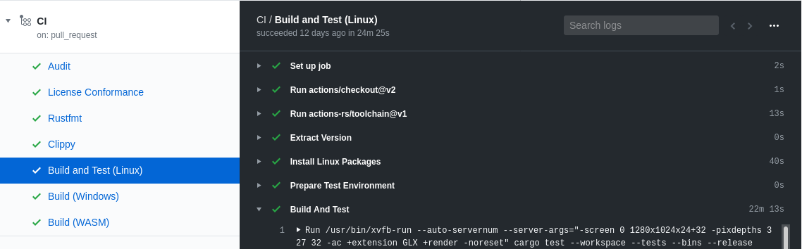

# Week 5: Tidying

## Summary

**Date:** 2020-04-12 to 2020-04-18

* Input configuration loads from server.
* `amethyst_test` updated to work with winit 0.22.0 event loop.

    Tests that require a graphical backend can run on CI without dedicated graphics cards by using the software GL rendering backend -- tests can be run through XVFB.

### End Result

## Implementation

1. Load input configuration from server using JavaScript. ([amethyst#2214], [pong_wasm#4])

    This is simply a `fetch` invocation. For better UX, we should:

    1. Initialize the fetch from within the application
    2. Return control to the browser so that it is responsive, and indicate to the user that a resource is being fetched, such as by rendering a spinner.
    3. Resume application initialization after the fetch has returned.

2. Remove requirement to specify `shred` in crate `[patch]` section. ([amethyst#2238])
3. Update `amethyst_test` framework to work with new `winit`.

    - Expose API function for bundles needing the `EventLoop` to be built. ([amethyst#2240])
    - Allow multiple `winit` event loops to run in sub threads. ([amethyst#2241], [amethyst#2245], [autexousious#222], [autexousious#223])

[amethyst#2214]: https://github.com/amethyst/amethyst/issues/2214
[amethyst#2238]: https://github.com/amethyst/amethyst/pull/2238
[amethyst#2240]: https://github.com/amethyst/amethyst/pull/2240
[amethyst#2241]: https://github.com/amethyst/amethyst/issues/2241
[amethyst#2245]: https://github.com/amethyst/amethyst/pull/2245
[autexousious#222]: https://github.com/azriel91/autexousious/issues/222
[autexousious#223]: https://github.com/azriel91/autexousious/pull/223
[pong_wasm#4]: https://github.com/amethyst/pong_wasm/pull/4
